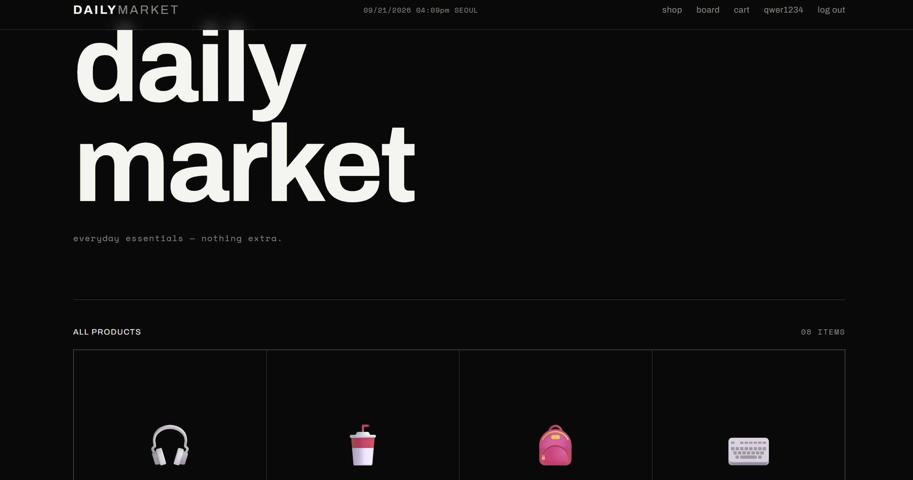

# wlsdn-lab.github.io
Locky study report

# [락키 스터디 2주차] AI로 PHP 사이트 만들고 스스로 보안 점검해보기

> 본 글은 보안 스터디 교육 목적으로, **본인이 만든 사이트**에서만 점검·수정한 기록입니다.

## TL;DR
- ○○ AI로 PHP+MySQL (로그인/게시판/업로드) 사이트를 만들어 무료 호스팅에 배포했다.
- 보안 점검 5대 관점으로 스스로 훑어 N개를 찾았고, 그중 3개를 패치했다.
- 느낀 점 한 줄:

## 1. 무엇을 만들었나
- 사이트 주제 / 기능:
- 스택: PHP + MySQL (mysqli), InfinityFree
- 사용한 AI와 핵심 프롬프트:
  ```
  내가 학과 동아리 스터디에서 진행하는 공격 방어하기 위한 사이트를 작성하려고해
  취약점은 있어도 상관이 없어
  컨셉은 쇼핑몰이고
  환경은 infinityfree에서 만들거야
  백엔드는 php, mysql이고
  기능은 아래와 같아
  회원가입, 로그인, 로그아웃, 회원탈퇴, 게시판(CRUD), 댓글기능, 마이페이지, 프로필 조회 •수정, 관리자 페이지
  이를 인피니티프리에 업로드 편하게 하나의 폴더로 만들어줘 
  ```
- 화면 캡처 (URL 표시줄은 가리기)



## 2. 배포하면서 막힌 점
- 문제 → 해결: 사이트를 만드는 과정에 MySql에 스키마에 문자셋이 달라서 오류가 발생했었지만, 수정하여 해결함
- MySql 비밀번호 때문에 문제가 발생했었지만, 서브 도메인 비밀번호를 그대로 사용한다는 것을 알고 해결함

## 3. 5대 관점 셀프 점검
| # | 관점 | 확인 결과 | 조치 |
|---|---|---|---|
| 1 | 입력검증 (SQLi/XSS) |취약(SQLi·Stored XSS 발견) | XSS만 패치 완료 / SQLi 미패치 |
| 2 | 인증/세션 |안전함 | 패치 안함 |
| 3 | 접근제어 |대체로 안전/관리자 삭제 기능이 GET 방식이라 URL 직접 호출로 실행되어 CSRF와 결합 시 위험 |미패 |
| 4 | 파일업로드 |안전 |패치 안함 |
| 5 | 설정/노출 |SQL 에러 노출 |미패치 |
> 공방전이 끝날 때까지 **미패치 항목은 비워 두고**, S4 이후 업데이트합니다.

## 4. 패치 기록 (3개)
### 4-1. Stored XSS — 댓글 출력
- 문제: 댓글 내용을 이스케이프 없이 그대로 출력 → 저장된 <script>가 다른 사용자 브라우저에서 실행됨 (Stored XSS)
- Before
  ```php   <div class="comment-body"><?= nl2br($c["content"]) ?></div>
  ```
- After
  ```php   <div class="comment-body"><?= nl2br(h($c["content"])) ?></div>
  ```
- 확인: 댓글에 <b>test</b> 입력 시 — 패치 전엔 test(굵게), 패치 후엔 <b>test</b> 글자 그대로 표시. <script>alert(1)</script>도 실행 안 됨.

### 4-2.
### 4-3.

## 5. AI가 짠 코드에서 느낀 점
- AI가 기본으로 놓친 것 / 잘한 것:
- 다음에 AI에게 요청할 때 바꿀 점:

## 6. 다음 주
- 공방전 1차(공격) — 남의 사이트에서 무엇을 찾아볼지
