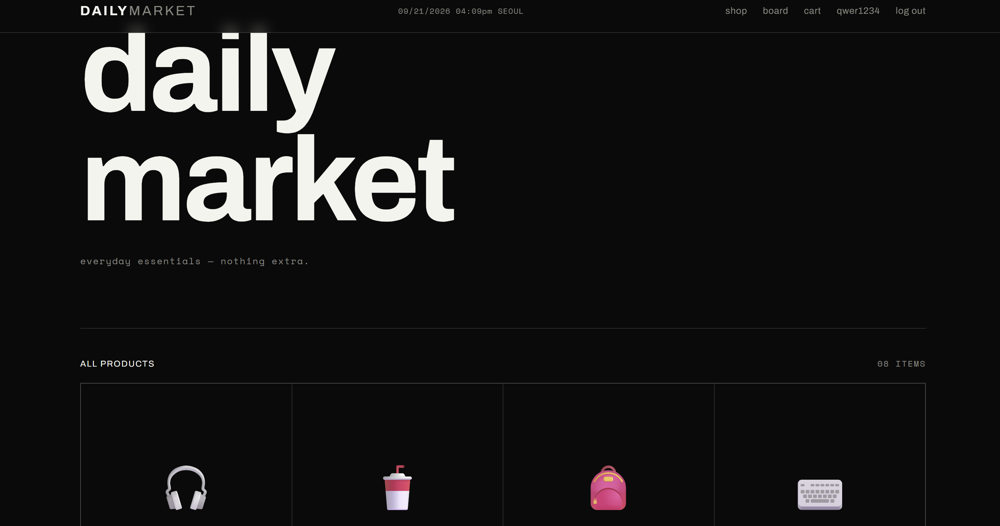

# wlsdn-lab.github.io
Locky study report

# [락키 스터디 2주차] AI로 PHP 사이트 만들고 스스로 보안 점검해보기

> 본 글은 보안 스터디 교육 목적으로, **본인이 만든 사이트**에서만 점검·수정한 기록입니다.

## TL;DR
- claude AI로 PHP+MySQL (로그인/게시판/업로드) 사이트를 만들어 무료 호스팅에 배포했다.
- 보안 점검 5대 관점으로 스스로 훑어 3개를 찾았고, 그중 1개를 패치했다.
- 느낀 점 한 줄: ai의 성능이 대단해서 감탄했고, 나중에 일을 할 때 이런 식으로 보고서를 많이 쓴다고 들었는데 그때를 대비해 이런 연습을 많이 해야겠단 생각이 들었다.

## 1. 무엇을 만들었나
- 사이트 주제 / 기능:
- 스택: PHP + MySQL (mysqli), InfinityFree
- 사용한 AI와 핵심 프롬프트:
  ```
  내가 학과 동아리 스터디에서 진행하는 공격 방어하기 위한 사이트를 작성하려고해
  취약점은 있어도 상관이 없어
  컨셉은 쇼핑몰이고
  환경은 infinityfree에서 만들거야
  백엔드는 php, mysql이고
  기능은 아래와 같아
  회원가입, 로그인, 로그아웃, 회원탈퇴, 게시판(CRUD), 댓글기능, 마이페이지, 프로필 조회 •수정, 관리자 페이지
  이를 인피니티프리에 업로드 편하게 하나의 폴더로 만들어줘 
  ```
- 화면 캡처 (URL 표시줄은 가리기)



## 2. 배포하면서 막힌 점
- 문제 → 해결: 사이트를 만드는 과정에 MySql에 스키마에 문자셋이 달라서 오류가 발생했었지만, 수정하여 해결함
- MySql 비밀번호 때문에 문제가 발생했었지만, 서브 도메인 비밀번호를 그대로 사용한다는 것을 알고 해결함

## 3. 5대 관점 셀프 점검

| # | 관점 | 확인 결과 | 조치 |
| --- | --- | --- | --- |
| 1 | 입력검증 | 취약 (SQLi·Stored XSS 발견) | XSS만 패치 / SQLi 미패치 |
| 2 | 인증세션 | 안전함 | 패치 안함 |
| 3 | 접근제어 | 대체로 안전. 관리자 삭제가 GET이라 CSRF 결합 시 위험 | 미패치 |
| 4 | 파일업로드 | 안전 | 패치 안함 |
| 5 | 설정노출 | SQL 에러 노출 | 미패치 |

> 공방전이 끝날 때까지 **미패치 항목은 비워 두고**, S4 이후 업데이트합니다.

## 4. 패치 기록 (3개)
### 4-1. Stored XSS — 댓글 출력
- 문제: 댓글 내용을 이스케이프 없이 그대로 출력 → 저장된 'script'가 다른 사용자 브라우저에서 실행됨 (Stored XSS)
- Before
  ```php
  <div class="comment-body"><?= nl2br($c["content"]) ?></div>
  ```
- After
  ```php
  <div class="comment-body"><?= nl2br(h($c["content"])) ?></div>
  ```
- 확인: 패치 전엔 굵게 표시되고 alert(1) 실행됨, 패치 후엔 글자 그대로 표시되고 실행 안 됨.

```html
<b>test</b>
<script>alert(1)</script>​
```

패치 전엔 굵게 표시되고 alert(1) 실행됨, 패치 후엔 글자 그대로 표시되고 실행 안 됨.

### 4-2. SQL Injection — 게시판 검색 (board.php) [미패치 · 공방전용]
- 문제: 검색어를 쿼리에 문자열로 직접 결합 + SQL 에러 원문 노출
- Before
  ```php
  $sql = "SELECT ... WHERE p.title LIKE '%$q%' ORDER BY p.id DESC";
  $res = mysqli_query($conn, $sql);
  if (!$res) { $err = mysqli_error($conn); }
​  ```
- After: 처음부터 패치가 너무 많이 되어서 부득이하게 공방전을 위해서 미패치 상태로 두었습니다. S4에서 수정하겠습니다!
  
### 4-3. CSRF — 상태변경 요청에 토큰 없음 [미패치 · 공방전용]
- 문제: 요청이 우리 폼에서 온 건지 검증하지 않음 → 외부 페이지가 로그인된 피해자 대신 댓글 작성·삭제를 유발 가능
- Before
  
```php
<form class="comment-form" action="post.php" method="post">
  <input type="hidden" name="action" value="add_comment">
  <input type="hidden" name="post_id" value="...">
  <textarea name="content"></textarea>
  <button type="submit">post comment</button>
</form>
```

- After: 이것도 공방전을 위해서 s4에서 패치 하겠습니다 죄송합니다.

## 5. AI가 짠 코드에서 느낀 점
- AI가 기본으로 놓친 것: 공방전 학습용 이라고 말을 했지만, 거의 모든 것을 다 막아놓은 것이 아쉬웠습니다. 제가 다시 한번 말을 해야지 학습용으로 취약점을 남겨두었었습니다. 그 점이 조금 아쉬웠습니다.
- 잘한 것: 순식간에 php와 mysql 전부다 엄청나게 높은 퀄리티로 오류 없이 원하는 대로 구현 해줘서 놀랐습니다.
- 다음에 AI에게 요청할 때 바꿀 점: 내가 원하는 것을 명확하게 이해 가능하게 질문 자체를 세세하게 해야겠다는 생각이 들었습니다.

## 6. 다음 주
- 공방전 1차(공격) — 남의 사이트에서 무엇을 찾아볼지


# 취약점 진단 보고서 — 대상: 26501001mj.xo.je

> 본 진단은 보안 스터디 공방전에서 상호 합의된 대상 사이트에 한해 수행되었습니다.

## 1. 점검 요약 (5대 관점 판정표)

| 관점 | 판정 | 심각도 |
| --- | --- | --- |
| SQLi | 취약 | High |
| XSS | 취약 | Medium |
| IDOR/접근제어 | 미확인 | - |
| 인증우회 | 미확인 | - |
| 업로드/설정 | 미점검 | - |

## 2. 취약 항목 상세

### [High] 게시글 조회 SQL Injection

- 위치: `view.php` 의 `id` 파라미터 (GET)
- 요약: `id` 값에 작은따옴표 주입 시 서버 500 에러가 발생하여, 입력이 SQL 쿼리에 직접 결합됨을 확인
- 재현 절차:
  1. `view.php?id=7` 로 정상 게시글 조회
  2. `id` 값에 작은따옴표(`'`) 추가 → 서버 500 Internal Server Error 발생
  3. 정상 값은 200, 따옴표 주입 시 500 → 쿼리 구문이 입력으로 깨짐 = injection 존재
- 사용 페이로드:

​```sql
7'
​```

- 증거:  


- 영향 & 권고:
  - 영향: SQL 구문 조작 가능 → 추가 분석 시 DB 데이터(계정·상품 등) 탈취로 이어질 수 있음
  - 권고: Prepared Statement(파라미터 바인딩)로 전환, id는 정수형으로 강제 캐스팅, SQL 에러 화면 노출 금지

### [Medium] 게시판 저장형 XSS

- 위치: 게시판 글/댓글 작성 → 출력 화면
- 요약: 입력한 스크립트가 이스케이프 없이 저장·출력되어, 해당 글을 여는 모든 사용자 브라우저에서 실행됨
- 재현 절차:
  1. 글/댓글 내용에 스크립트 입력 후 등록
  2. 해당 글을 열 때마다 스크립트가 실행되어 경고창 표시
  3. 새로고침·재방문 시에도 반복 실행 → 저장형(Stored) 확인
- 사용 페이로드:

​```html
<script>alert(1)</script>
​```

- 증거: 

- 영향 & 권고:
  - 영향: 세션 쿠키 탈취(`document.cookie`), 피해자 계정 도용, 악성 스크립트 배포
  - 권고: 모든 사용자 입력 출력 시 htmlspecialchars 적용, 입력값 검증

## 3. 미확인 / 추가 점검 필요 항목

- 로그인 SQL Injection: 인증우회 페이로드 시도했으나 우회 여부 미확정 (추가 점검 필요)
- 상품구매 로직: 수량·가격 파라미터 조작 가능성 미점검
- IDOR: `view.php?id` 번호 변경으로 비공개 데이터 접근 여부 미확인
- 파일업로드/설정: 미점검

## 4. 종합 의견

- 확인된 취약점 중 SQL Injection(High)이 가장 위험도가 높으며, DB 데이터 탈취로 이어질 수 있어 우선 조치가 필요함
- 저장형 XSS(Medium)는 세션 탈취로 계정 도용이 가능하므로 함께 조치 권장
- 공통 원인: 사용자 입력에 대한 검증·이스케이프·파라미터 바인딩 부재


# 취약점 진단 보고서 — 대상: fakesangjun.xo.je (자체 진단)

> 본 진단은 본인이 제작한 사이트를 대상으로, Burp Suite를 이용해 직접 수행한 자가 점검 기록입니다.

## 1. 점검 요약 (5대 관점 판정표)

| 관점 | 판정 | 심각도 |
| --- | --- | --- |
| SQLi | 취약 | High |
| XSS | 취약 (패치 완료) | Medium |
| IDOR/접근제어 | 안전 | - |
| 인증우회 | 안전 | - |
| 업로드/설정 | 해당없음 / 정보노출 있음 | - |

## 2. 취약 항목 상세


### [High] 게시판 검색 SQL Injection

- 위치: `board.php` 의 `q` 파라미터 (GET)
- 요약: 검색어가 쿼리에 직접 결합되어, 로그인 없이 전체 회원의 아이디와 비밀번호 해시를 탈취할 수 있음
- 재현 절차:
  1. `board.php?q=hello` 정상 검색 (결과 0건)
  2. `q` 값에 `'` 입력 → SQL 에러 발생 (주입 가능 확인)
  3. `q` 값에 `' OR '1'='1` 입력 → 조건 무력화, 전체 글 노출
  4. `q` 값에 UNION 페이로드 입력 → 회원 아이디·비밀번호 해시 유출
- 사용 페이로드:

​```sql
' OR '1'='1
' UNION SELECT 1,username,3,4,password,6 FROM users-- -
​```

- 증거: 
 


- 영향 & 권고:
  - 영향: 전체 회원 계정(아이디 + bcrypt 해시) 유출 → 해시 크래킹 시 계정 탈취 가능
  - 권고: Prepared Statement(파라미터 바인딩) 전환, SQL 에러 메시지 화면 노출 금지

### [Medium] 댓글 저장형 XSS (패치 완료)

- 위치: 게시글 댓글 (`post.php` 댓글 출력)
- 요약: 댓글이 이스케이프 없이 출력되어 저장된 스크립트가 열람자 브라우저에서 실행됨
- 재현 절차:
  1. 댓글에 `<b>test</b>` 입력 → 굵게 렌더링 (HTML 실행 확인)
  2. `<script>alert(1)</script>` 입력 → 해당 글 열람 시 경고창 실행 (저장형 확인)
  3. `h()`(htmlspecialchars) 적용 후 → 글자 그대로 표시, 실행 안 됨
- 사용 페이로드:

​```html
<b>test</b>
<script>alert(document.cookie)</script>
​```

- 증거: 

- 영향 & 권고:
  - 영향: 세션 쿠키 탈취, 피해자 계정 도용
  - 권고: 모든 사용자 입력 출력 시 htmlspecialchars 적용 (적용 완료)


## 3. 참고 — 안전하다고 판정한 항목

- IDOR/접근제어: 프로필·글은 공개지만 수정·삭제는 소유권 검사가 있어 타인 데이터 변경 불가
- 인증우회: `/admin`, `/mypage` 는 로그인·관리자 권한 검사가 정상 동작
- 업로드: 파일 업로드 기능 자체가 없어 해당 없음

## 4. 종합 의견

- SQL Injection(High)이 가장 위험하며, 로그인 없이 전체 계정 정보 탈취가 가능해 최우선 조치 대상
- Stored XSS(Medium)는 패치 완료했으나, CSRF는 공방전 진행을 위해 의도적으로 미패치 상태 유지 (S4에서 패치 예정)
- 공통 원인: 사용자 입력에 대한 파라미터 바인딩·이스케이프 부재


